# Figma: The Basics

Figma is the first interface design tool based in the browser, making it easier for teams to create software. Design, prototype, and gather feedback all in one place with Figma.

Because Figma is all in the cloud, never upload, download, or worry about versions again. Present and prototype in the same tool where you design for one single source of truth for design files.

## Introduction

Welcome to Figma! We're excited to have you here. 

You can refer to this documentation whether your a beginer looking to learn all the basics, or an expert looking to just
brush up on a few topics.

In this document, you'll find guides to using diferent tools and features available on Figma.

### Figma's Features

We've compiled a (not-so) small list of all the powerful things Figma is capable of doing. 
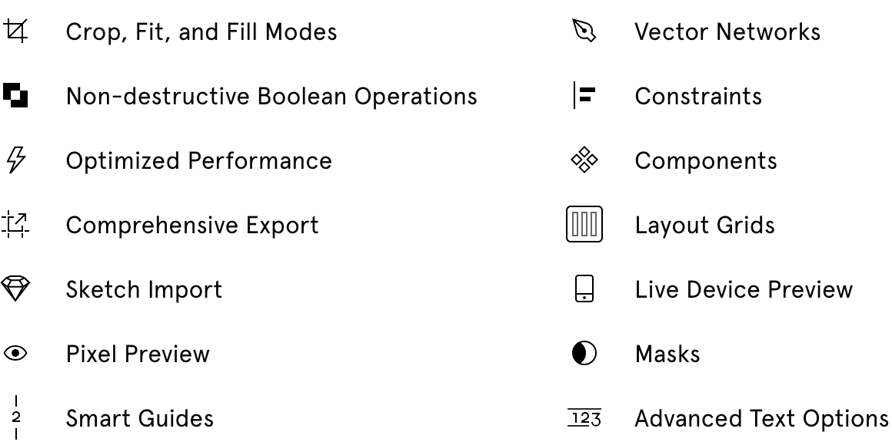 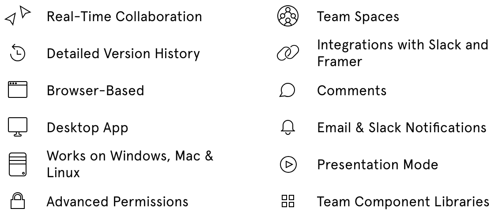

### For UX

*Form the Experience Together*

Create better UX design by suportin collaborate across the design process.

FIGMA helps you:
        
 - Create your wireframes quickly and easily with intuitive features.
 
    → Make your wireframes interactive with prototype mode.
        
 - Easily share wireframes and collect feedback in real-time or async.
 
    → Share the wreframe with anyone via a single, live URL that works on any platform.
  
 - Easily keep everyone up to date on the latest wireframe.
    
    → Iterate effectively and efficintly by getting everyone’s feedback directly in the file.

### For Web Design

*An Online Graphic Design Tool*

All the elements you need to create amazng logos, social mediang graphics, presentations and more, for free.

FIGMA helps you:

 - Customize your graphic design assets with powerful features.

    → Use vector networks give a wholing new dimension to vector manipulation.
 
 - Design right in the brower. Everything lives online, for free.

    → Access hundreds of fonts, shapes, and colors to create 
        gorgeous graphics.

 - Incorporate design into the process of building digital products.
    
    → Easily share graphic designs with a single, live URL to quickly get feedback.

### For Wireframing

*A Free, Online Wireframe Tool*

Wireframing has never been easier. With Figma, it is easy to visually communicate your idea.

FIGMA helps you:

 - Create your wireframes quickly and easily with intuitive features.

    → Make your wireframes interactive with prototype mude.

 - Share the wireframe with anyone via a single, live URL that works on any platform.

   → Iterate effectively and efficiently by getting everyone’s feedback directly in the file.

 - Stay in the flow by ideating, creating and collaborating in one end-to-end tool.
 
    → Reduce friction and save time by eliminating multipe tools.
 
## Figma Basics

Use the list below to quickly find the guide you need.

- [Text tools and fonts](#text-tools-and-fonts)         
- [Effects](#effects)
- [Layout grids](#layout-grids)
- [Guides](#guides)
- [Gradients](#gradients)
- [Rounded corners](#rounded-corners)
- [Masks](#masks)
- [Color picker](#color-picker)
- [Boolean operations](#boolean-operations)
- [Exporting](#exporting)
- [Constraints](#constraints)
- [Prototyping](#prototyping)
- [Transitions](#transitions)

### Text Tools and Fonts

Fonts are a critical component of interface design – the font you select determines the readability and appeal of your text. The color, size, spacing, and width all convey a message to your product users.
####Create a text box
1. Access the text tool by clicking the *Text Tool (T)* in the Toolbar on top.
1. Create a text element by single clicking and typing. The width of your text box will grow with your text.
1. To edit an exisitng text element, double click the text box.

#### Edit your text

Use the Design kit on the right side of screen to justify and align your text.
Take a look at the lower half. You can use this to adjust:

- Font
- Fill
- Line Height
- Letter Spacing
- Justification
- Alignment

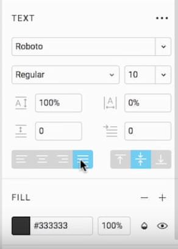

### Effects

Bring a little life to your design with effects, which can be applied to
layers or objects to change or adjust their appearance.
####Create a drop shadow
1. Click to select the shape layer itself.
1. Click on *Effects > ( + )* in the Properties panel.
1. To edit a shadow's blur, click on the style icon to the left. Here, you can adjust blur, offset, and intensity.
1. You can hide or show a shadow with the visibility icon on the right.

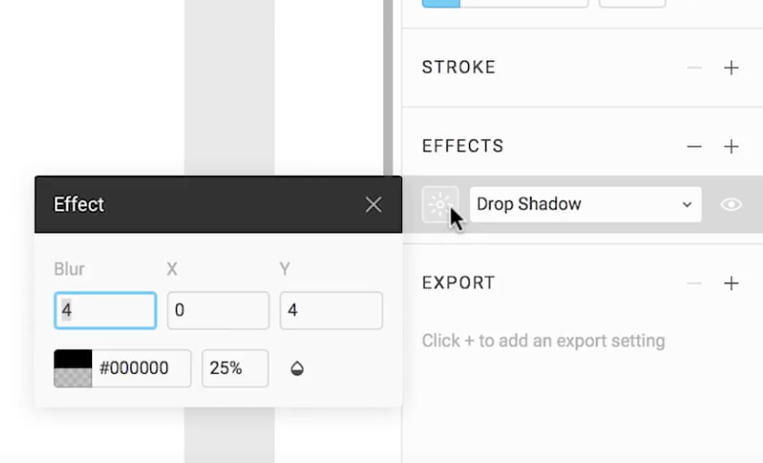

#### Add a background blur

1. Start by clicking on the background Layer
1. Select *Effects > Background Blur*. 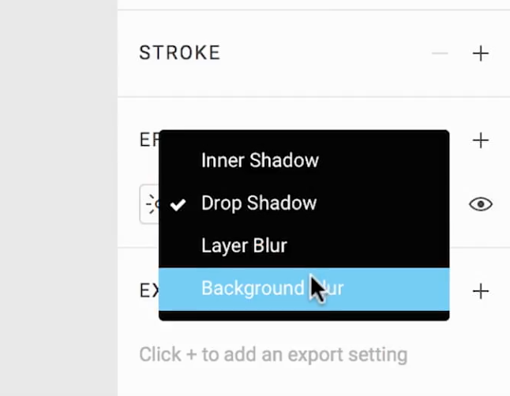
1. Click on the style icon on the left to adjust the intensity of the blur.

### Layout Grids

Layout grids are visual aids that help you keep elements precisely aligned in your frames. Grids are particularly helpful in designing for web or for different designs and devices.

#### Add a layout grid

1. Select or create a frame within our file.
1. Click *Layout Grid > ( + )* in the Properties Panel. By default, grids added to the frame will be at 10 px.
1. Adjust pixel size, color, and opacity of your grid. 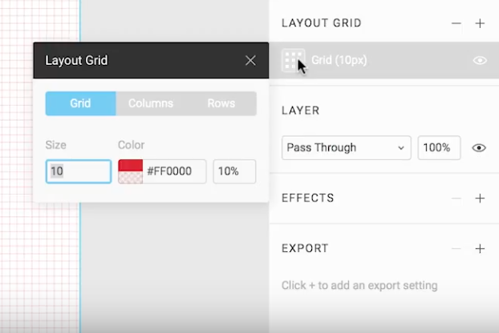
1. Click on *Columns* or *Rows* to adjust what kind of grid you want. 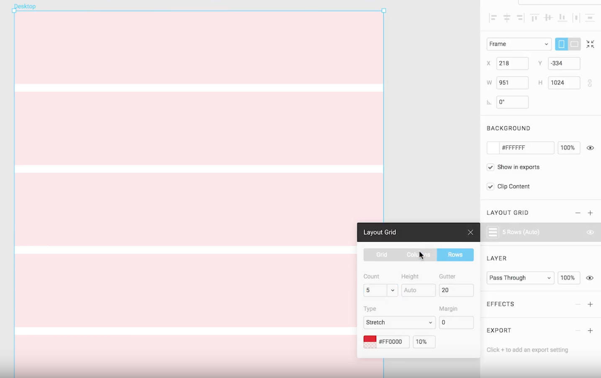

### Guides

Guides can be helpful when you're creating, aligning, and placing layers and objects within your file. Guides are thin red lines that can be moved and repositioned to ensure alignment. Guides do *not* appear on exported images – only in Figma.

#### Create a guide
1. Enable *Rulers* using the *Shift+R* shortcut.
1. Click on a vertical or horizontal ruler and drag towards the document. This will create a vertical or horizontal guide. 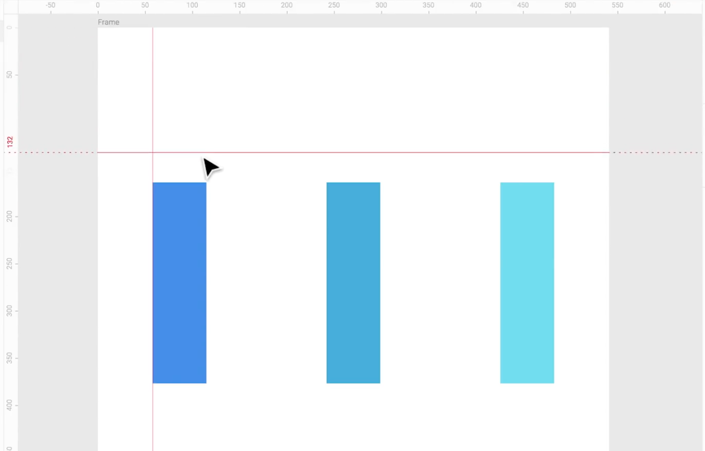
1. Select a shape to view the distance between the shape and the guide. 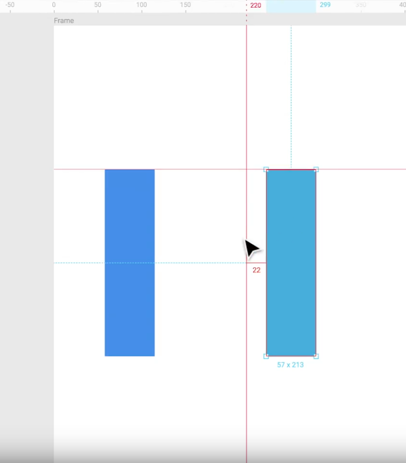
1. When you're done aligning, delete the guides by dragging them off the document and back to the ruler.

### Gradients

Gradients can be used for fills or transitional overlays on layers or objects.
They add a litle pizzazz to any design.

#### Create a gradient

1. Select the shape you want to fill with a gradient.
1. Navigate to the *Fill* option in the Properties Panel.
1. Change from a solid fill to a linear fill to create a gradient. 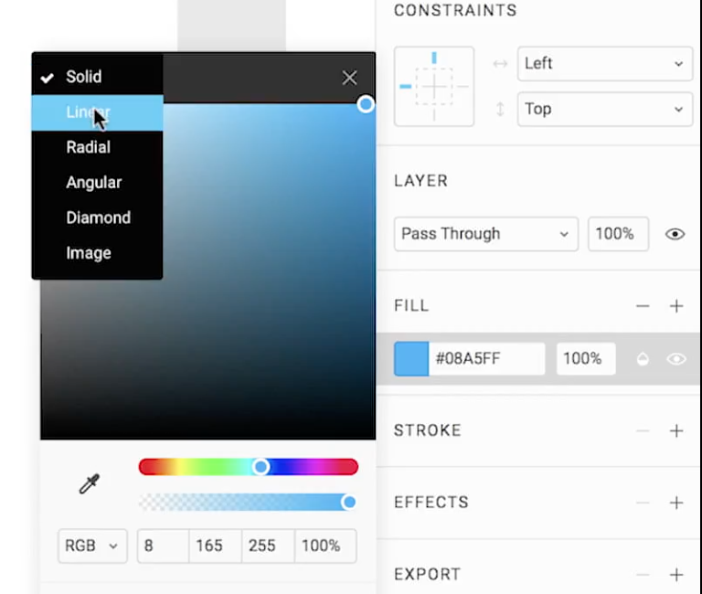 

#### Create a darcer gradient

1. Select the gradient color on the top. 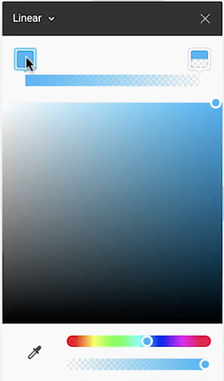
1. Adjust the color value on the bottom of the color panel. 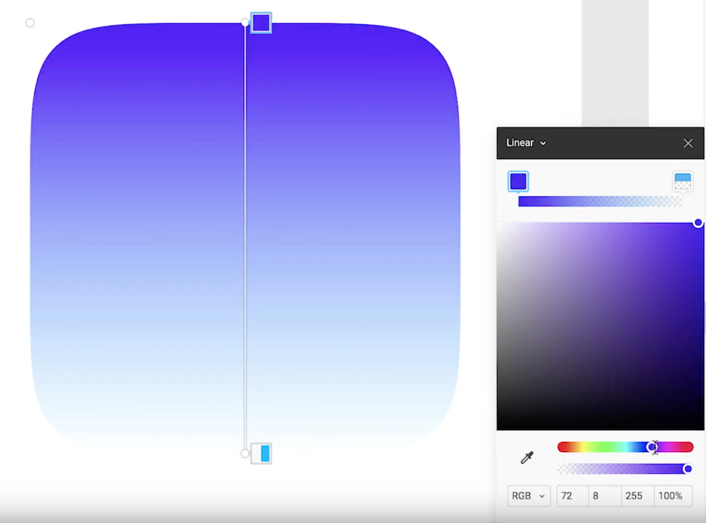

#### Add a color to the gradient

1. Click anywhere on the gradient slider.
1. Adjust the color on the color scale below. This will also create gradient controls on the canvas.
1. Use these gradient controls to change the length of your gradient as desired. 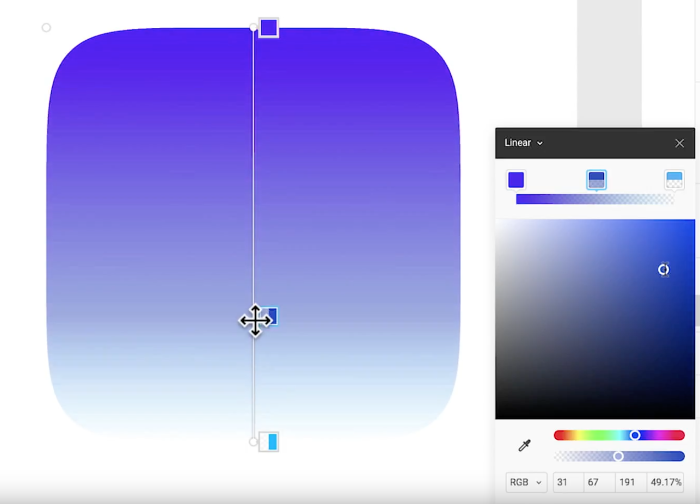

### Rounded Corners

Soften the edges of an polygon with rounded corners and make your interface
feel more friendly.

#### Create evenly rounded corners

1. Select the shape you want to manipulate.
1. In the properties panel in *Corner Radius*, type a single digit to modify all four corners. 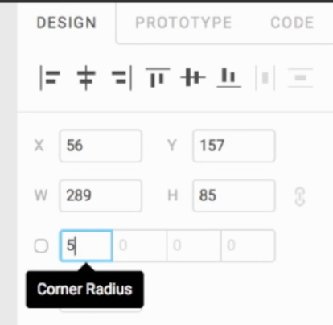

#### Create asymmetrical rounded corners

1. Select the shape you want to manipulate
1. To modify corners independently, click in the icon next to the leftmost textfield. 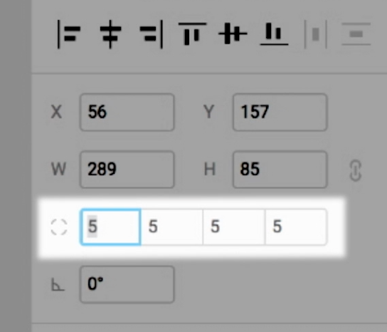
1. These text boxes allow you to adjust top left, top right, bottom left, and bottom right, respectively.

### Masks

Masks allow you to show specific portions of other layers. Use them to 
crop images or limit the visibility of objects in your project. 

Note that a mask applies to all layers above it.

#### Create a mask

1. Create a shape in the canvas to use as a mask.
1. Go to the top of the toolbar and select *Use as mask* This will create a mask group, which you can view on the left hand side. 
1. Select the image entry on the left and move it into the mask group. 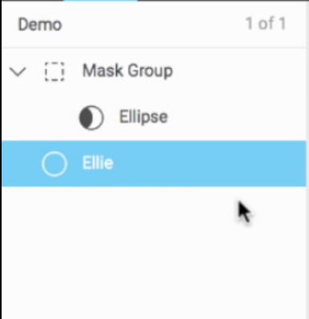 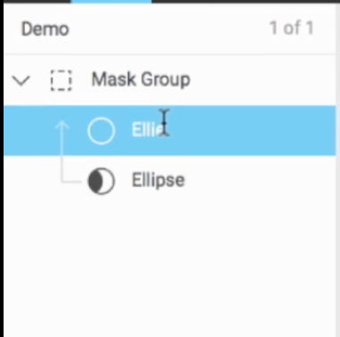
1. Drag the image over the original mask in the canvas. Only the parts of the image directly over the mask will be shown. 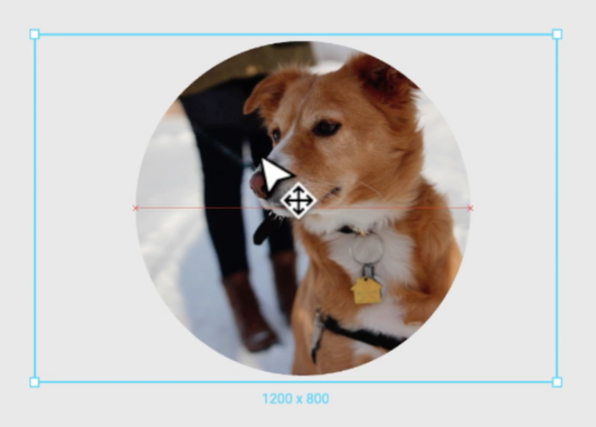

### Color Picker

Use color picker to sample a color, usually from an image so that you can use
the color within the project you're working on. 

#### Pick a color

1. Select the shape you want to apply the color to.
1. Click into *Fill* Tool and select the eyedropper tool. 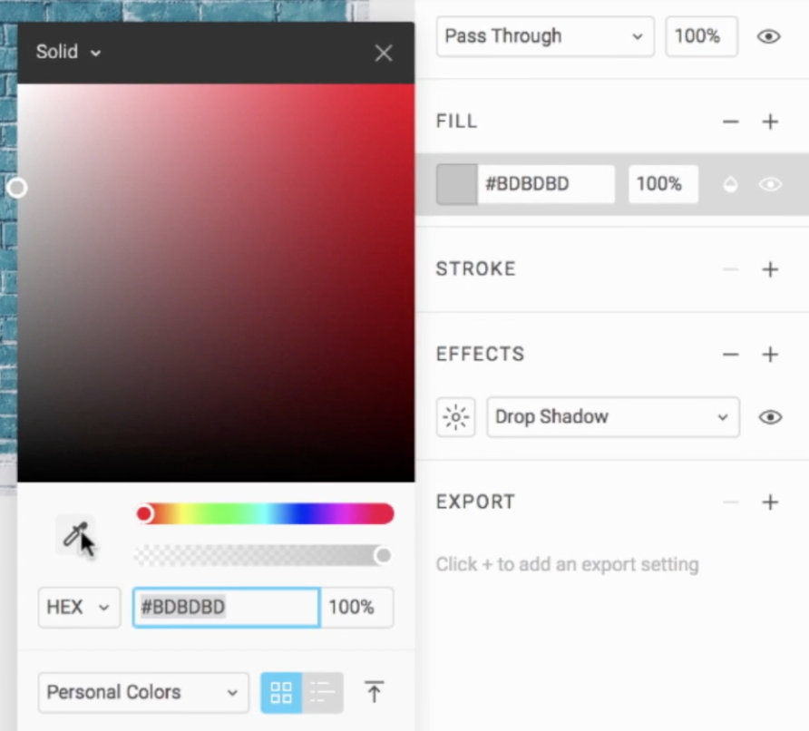
1. Hover over the color you want to select
1. Click to apply to shape.
1. To save the color, simply click the ( + ) in the color picker tool. 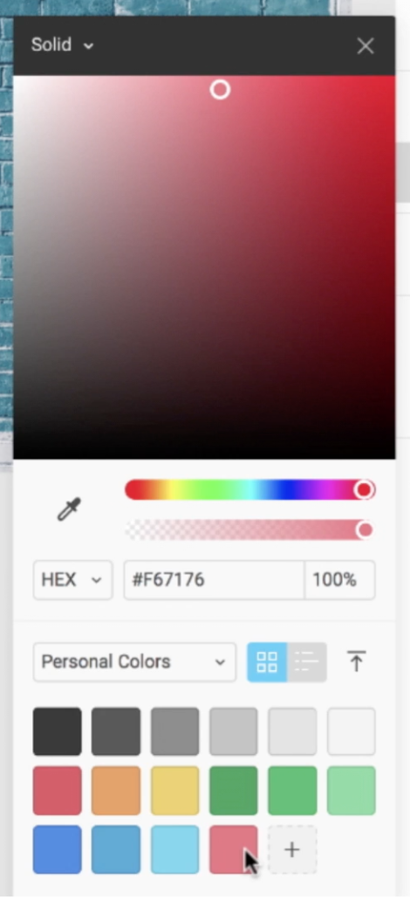 

#### Team, Personal, and Document Colors

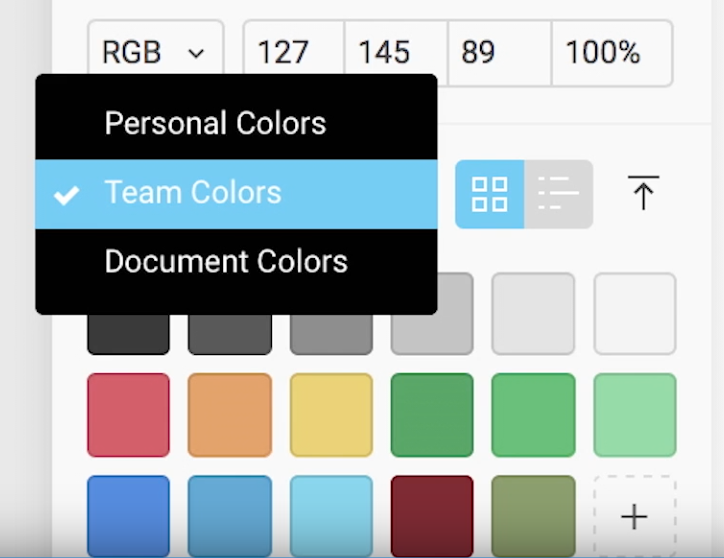

*Team Colors* lets you to create and share colors with any of your collaborators.
This allows you to use and share brand colors seamlessly to ensure 
consistency across all designs.

*Personal Colors* are not shared with the team, and are not document specific.
You can access, save, and reuse them in any project.

*Document Colors* are only available in a specific document. This is especially
helpful for working on a singular document for a specific client.

###Boolean Operations
Boolean operations are non-destructive and combine any set of shape layers 
through one of four formulas: *Union*, *Subtract*, *Intersect*, and *Exclude*.

*Union* combines the selected shapes into a boolean group. The new shape is a
composite of the two sublayers. 
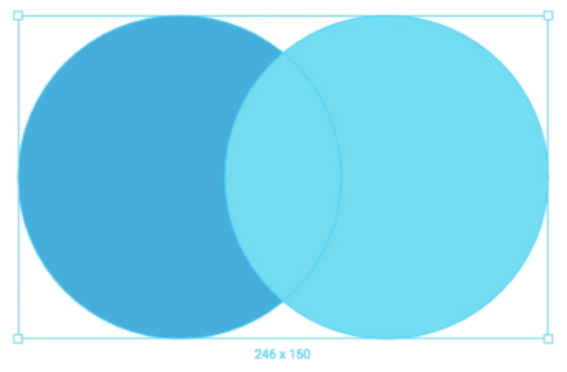
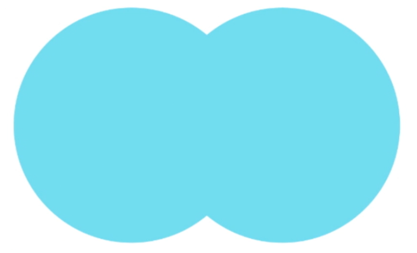

*Subtract* is the opposite of Union. It removes the area of a shape from a 
base shape – only the bottom layer will remain.

*Intersect* creates a boolean group of only the overlapping parts of the
original sublayers.
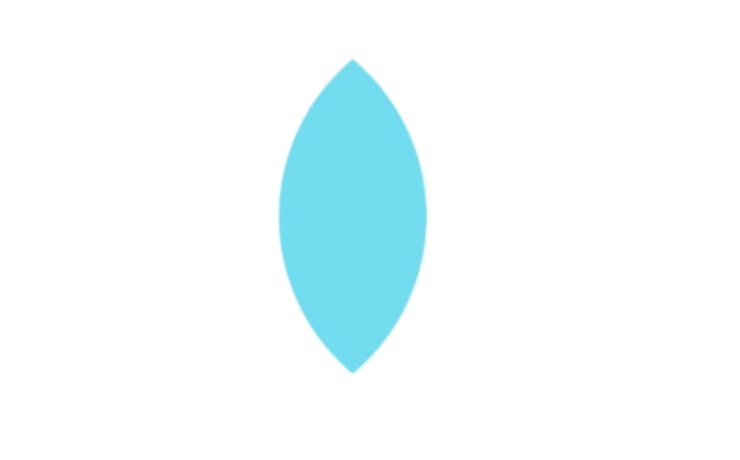

*Exclude* shows only the areas of the original sublayers that do not overlap.
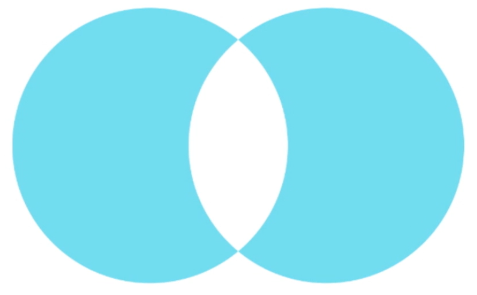

#### Use Boolean Operations

1. Select the two objects you want to perform the operation on.
1. In the top toolbar, access the boolean operations. 
1. Select the operation you wish to use.

### Exporting

Exports are possible on any layer in Figma for any object or objects. 
To export anything in a file, you must first select export settings.

#### Export a file

1. Select the objects or layers you want to export.
1. In the Properties panel on the right, set the size of your output, the output type, and if you would like overlap or contents only. A preview will display under the *Export* button. 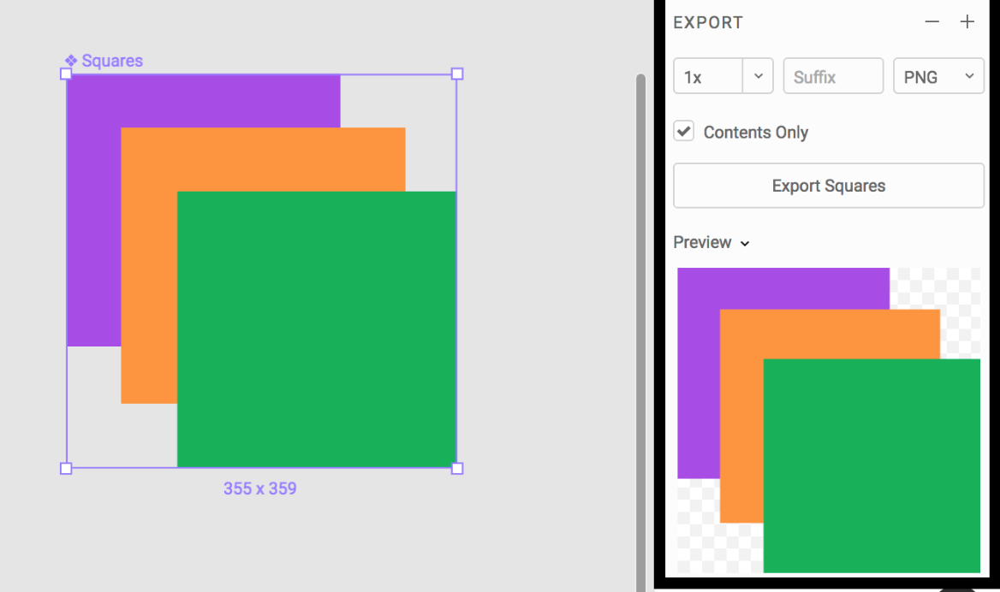
1. Select *Export*.

### Constraints

*Constraints* are one of Figma's most powerful features. As your frames change
size, constraints make sure that the elements inside stay put.

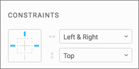

#### Set Constraints

1. Select the item within the frame you want to set a constrain for.
1. Click on the first menu in the *Constraints* section to set the horizontal constraint. You have a few options here:
   1. **Left**: The left side of the object will stay fixed to the left side of the frame.
   1. **Right**: The right side of the object will stay fixed to the right side of the frame.
   1. **Left and Right**: The object will stretch horizontally so that both the left and right sides remain fixed to the frame.
   1. **Center**: The object will remain in the same position relative to the center as the frame is resized.
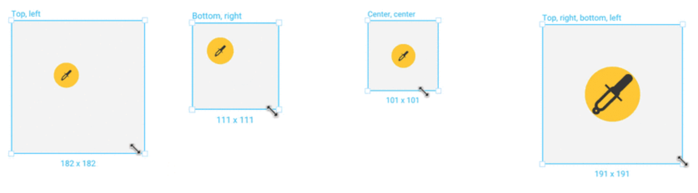
1. Click and elect from the second menu to set the vertical constraint. You can choose between:
   1. **Top**: The top  of the object will stay fixed to the top side of the frame.
   1. **Bottom**: The bottom of the object will stay fixed to the bottom of the frame.
   1. **Top and Bottom**: The object will stretch vertically so that both top and bottom remain fied to the frame.
   1. **Center**: The object will remain in the same position relative to the center as the frame is resized.
   1. **Scale**: The object will grow or shrink parallel to frame size

### Prototyping

Interactive prototypes allow you to demonstrate how a design will behave.
Connect the dots between your frames and visualize how your design might
look and feel once built.

#### Assemble prototype

1. Click the *Prototype* tab above the Properties panel to enter prototype mode. 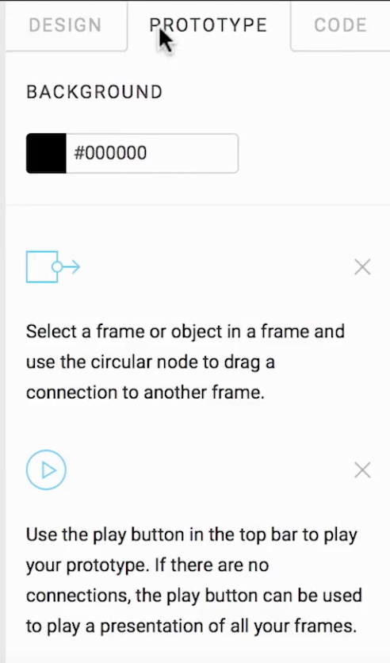
1. Select your starting frame. A blue circular node will appear on the right side of the element. 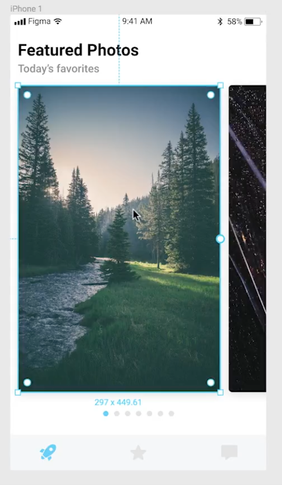
1. Click on a node and drag your mouse to connect the connection arrow to your desired destination frame. 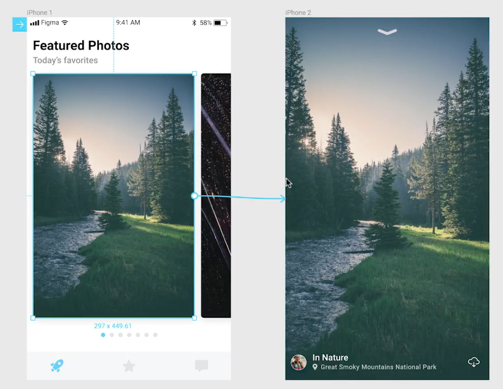
1. Select the *Present* icon in the upper right corner of the toolbar to present your prototype. 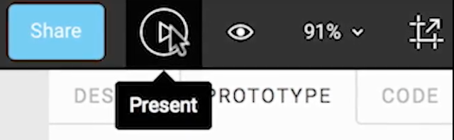

### Transitions

Bring your designs to life by adding common transitional animations as you
move between frames.

#### Create a transition
1. Enter prototype mode by clicking the *Prototype* tab above the Properties panel. 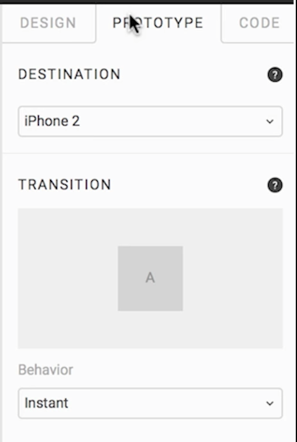
1. Choose one of four transition behavior to determine how the destination frame appears. An animation of the transition will be shown in a preview box.
    1. *Instant*: On tap, the destination frame immediately appears.
    1. *Dissolve*: The destination frame fades in at a pace you choose.
    1. *Slide*: The destination frame slides in from a chosen direction.
    1. *Push*: The old frame is pushed out of the way to reveal the destination frame. 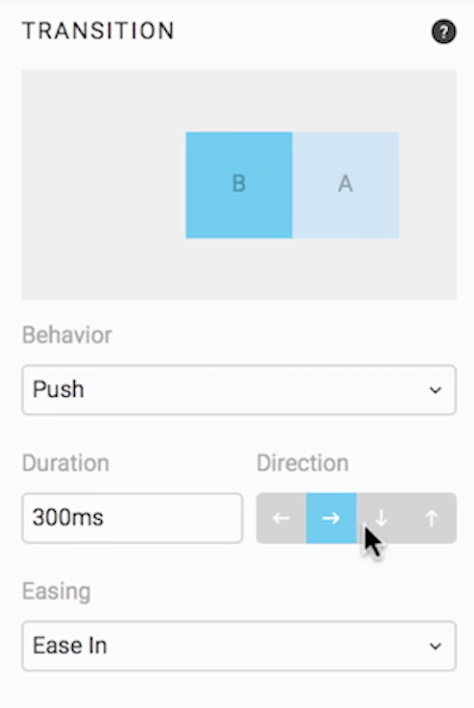
1. Click the start frame and drag your cursor to the destination frame to apply the transition.
